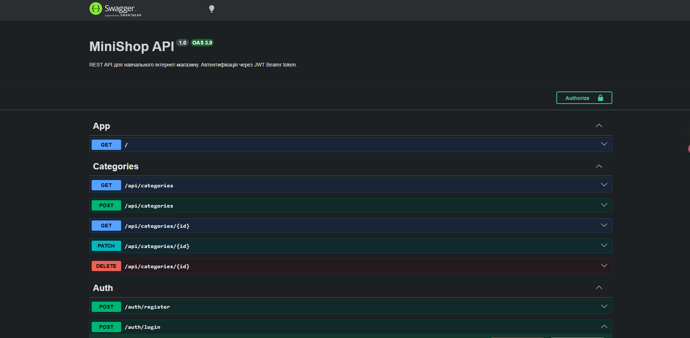

## Student
- Name: Зінченко Вікторія Ігорівна
- Group: 232.1

 
## Практичне заняття №6 — Interceptors + Exception Filters + Swagger

### Структура репозиторію
```text
.
├── src/
│   ├── auth/ ...
│   ├── users/ ...
│   ├── categories/ ...
│   ├── products/ ...
│   ├── common/
│   │   ├── enums/
│   │   │   └── role.enum.ts
│   │   ├── guards/
│   │   │   ├── jwt-auth.guard.ts
│   │   │   └── roles.guard.ts
│   │   ├── decorators/
│   │   │   ├── current-user.decorator.ts
│   │   │   └── roles.decorator.ts
│   │   ├── interceptors/
│   │   │   ├── logging.interceptor.ts
│   │   │   └── transform.interceptor.ts
│   │   ├── filters/
│   │   │   └── http-exception.filter.ts
│   │   └── pipes/
│   │       └── trim.pipe.ts
│   ├── migrations/
│   ├── main.ts
│   └── app.module.ts
├── swagger-screenshot.png
├── Dockerfile
├── docker-compose.yml
└── README.md
```
 
### Запуск проекту
cp .env.example .env
docker compose up --build
 
### Swagger UI
http://localhost:3000/api/docs
 

 
### Формат успішної відповіді
{
  "data": {
    "id": 5,
    "name": "MacBook Air M4",
    "description": "Flagship smartphone",
    "price": 1999.99,
    "stock": 50,
    "isActive": true,
    "category": {
      "id": 1
    },
    "createdAt": "2026-05-06T20:10:17.882Z",
    "updatedAt": "2026-05-06T20:10:17.882Z"
  },
  "statusCode": 201,
  "timestamp": "2026-05-06T20:10:17.921Z"
}
### Формат помилки
{
  "error": {
    "code": 400,
    "message": "Validation failed",
    "details": [
      "name must be longer than or equal to 2 characters",
      "price must not be less than 0.01"
    ],
    "traceId": "7c9aa92f-b4a6-444a-9ce3-0004b6bda678"
  },
  "timestamp": "2026-05-06T20:11:32.151Z"
}
### Приклад логів (LoggingInterceptor)
[Nest] 29  - 05/06/2026, 7:46:23 PM     LOG [HTTP] GET /api/products — 200 — 15ms
[Nest] 29  - 05/06/2026, 8:10:17 PM     LOG [HTTP] POST /api/products — 201 — 28ms
### Тест помилки з traceId
PS C:\Users\36981\-hlpf-env-setup> curl.exe http://localhost:3000/api/products/999
{"error":{"code":404,"message":"Product #999 not found","traceId":"d2b72ee1-2807-469e-935f-3240b1b50bbd"},"timestamp":"2026-05-06T19:54:29.415Z"}